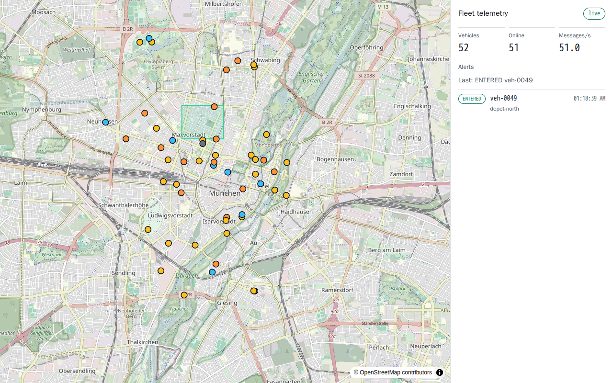
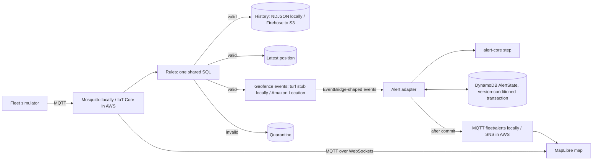

# 🛰️ iot-telemetry

> Fleet telemetry and geofence alerts. Noisy, duplicated geofence events become one alert per real crossing.

A simulated vehicle fleet publishes telemetry over MQTT. One set of IoT Rule SQL routes it locally (Mosquitto) and in AWS (IoT Core, CDK). A small, pure alert core turns noisy and duplicated geofence events into exactly one alert per real crossing. A live MapLibre map shows the fleet and the alerts.

<!-- readme-header -->
[](https://github.com/sathwikbairaboina2/iot-telemetry/actions/workflows/ci.yml)    

| Measured | Source |
|---|---|
| **p99 7.2 ms** | `bench/results/latest.json` |
| **0 duplicate alerts** | `bench/results/latest.json` |

**Measured:** 200 simulated vehicles at 1 Hz, 12000 messages sent and 12000 received, p99 7.2 ms publish-to-subscriber over MQTT-over-WebSockets. Across 1000 fuzzed geofence timelines (alternating ENTER/EXIT, as a geofence service emits them) with duplicate deliveries, naive alerting fired 7829 ENTER alerts for 15625 deliveries; the alert core fired 3184 ENTERED alerts, and 5896 alerts counting EXITED too, exactly the 5896 crossings of an independent reference model (0 duplicates, 0 missed). Numbers come from `bench/results/latest.json`; see [Benchmark](#benchmark).



## Run it in 2 minutes

```sh
docker compose up -d --build
```

Open <http://localhost:5373>. You will see about 50 vehicles moving around Munich, the Depot North geofence, and a live alert list. Two scripted vehicles run alongside the fleet. `veh-9001` hovers across the depot edge for a minute, then parks inside: naive alerting would fire on every crossing, the core fires one ENTERED about 2 minutes in and one EXITED later. `veh-9002` drives into the depot while its radio is down; its buffered messages are replayed afterwards and the alerts come out the same as an uninterrupted run.

Stop everything with `docker compose down`. Ports used on the host: 5370 (MQTT), 5371 (MQTT over WebSockets), 5372 (DynamoDB Local), 5373 (web).

## Why this exists

Geofence alerts are noisy. GPS jitter at a boundary produces ENTER, EXIT, ENTER within seconds, and at-least-once delivery (EventBridge, MQTT QoS 1) repeats events. An alert per event spams the operator.

The alert core ([`packages/alert-core`](packages/alert-core)) debounces the raw signal in device time:

- A vehicle is confirmed inside after 60 s continuously inside, and confirmed outside after 30 s continuously outside.
- A redelivered event is a no-op. An event older than the last applied one is dropped and counted.
- It has no clock, no IO and no runtime dependencies. Time arrives as event fields, so every run is reproducible.

Guarantees and limits: under any reordering, alerts alternate ENTERED/EXITED, never go backwards in time and have unique ids. Completeness (every real crossing reported) holds for time-sorted delivery with any number of redeliveries. With reordering inside a 10 s window, some crossings are missed (see the benchmark), and the number is reported rather than hidden.

## Architecture



The cloud half is proven by `cdk synth`, assertion tests and cdk-nag. It has not been deployed (no AWS account was used). Locally, DynamoDB Local and Mosquitto stand in for the managed services.

## Install the alert core

```sh
npm i @iot-telemetry/alert-core
```

Not yet published to npm. Build the tarball with `pnpm --filter @iot-telemetry/alert-core pack`, or run the check below.

```ts
import { run, DEFAULT_CONFIG, type CoreEvent } from '@iot-telemetry/alert-core';

const events: CoreEvent[] = [
  { kind: 'ENTER', eventId: 'a', vehicleId: 'v1', geofenceId: 'depot', deviceTs: 0 },
  { kind: 'ENTER', eventId: 'a', vehicleId: 'v1', geofenceId: 'depot', deviceTs: 0 }, // redelivery
  { kind: 'TICK', vehicleId: 'v1', geofenceId: 'depot', deviceTs: 61_000 },
];
console.log(run(events, DEFAULT_CONFIG).alerts); // one ENTERED alert
```

## Benchmark

Reproduce with `docker compose --profile bench run --rm bench`. It writes `bench/results/latest.json`.

Measured 2026-10-04T00:37:00.409Z, `where: compose`, Node v24.21.0 on linux, broker `eclipse-mosquitto:2.1.2-alpine`. Publisher and subscriber run in one process on one clock.

| Publish to subscriber latency (200 vehicles, 1 Hz, 60 s) | Value |
|---|---|
| sent | 12000 |
| received | 12000 |
| p50 (ms) | 0.287841796875 |
| p95 (ms) | 2.1865234375 |
| p99 (ms) | 7.212890625 |
| max (ms) | 256.843505859375 |
| mean (ms) | 0.6868959147135417 |

The max is a single slow outlier; one run is not a distribution of runs.

| Alert correctness (1000 seeded timelines, seed 42, duplicate rate 0.2) | Value |
|---|---|
| deliveries (events plus redeliveries) | 15625 |
| naive alerts (one per ENTER delivery) | 7829 |
| core alerts (ENTERED plus EXITED) | 5896 |
| core ENTERED alerts (compare with naive) | 3184 |
| reference crossings (independent model) | 5896 |
| duplicate alerts | 0 |
| missed alerts | 0 |

| Reordering inside a 10000 ms window | Value |
|---|---|
| invariant violations | 0 |
| events dropped as late | 182 |
| crossings missed versus the reference | 64 |

Loiter scenario through the full pipeline: 8 naive ENTER alerts, 2 core alerts (1 ENTERED, 1 EXITED).

## Decisions

- [ADR 0001](docs/adr/0001-pure-alert-core-debounce.md): a pure alert core with a debounced, device-time state machine.
- [ADR 0002](docs/adr/0002-local-stand-ins-without-localstack.md): local stand-ins instead of LocalStack; the cloud stack is proven by synth and assertions.
- [ADR 0003](docs/adr/0003-history-firehose-s3-not-timestream.md): history goes to Firehose and S3, not Timestream.
- [ADR 0004](docs/adr/0004-optimistic-concurrency-transaction.md): a version-conditioned transaction for alert state; SNS after commit.
- [ADR 0005](docs/adr/0005-ticks-local-per-message-cloud-sweep.md): dwell ticks come from telemetry locally and from a one-minute sweep in the cloud.
- [ADR 0006](docs/adr/0006-sim-seq-reserved-blocks.md): simulator sequence numbers are allocated in persisted blocks.
- [ADR 0007](docs/adr/0007-toolchain-and-versions.md): toolchain and pinned versions.
- [ADR 0008](docs/adr/0008-host-ports-and-demo-data.md): host ports, synthetic routes and OSM raster tiles.

## Limits

- No AWS deployment was tested. The CDK stack passes `cdk synth`, assertion tests and cdk-nag (AwsSolutions), nothing more.
- Mosquitto runs without authentication. The IoT device policy is in the stack, but there are no certificates or provisioning.
- Routes are synthetic loops around Munich, and the map uses public OpenStreetMap raster tiles.
- Timestream is not used (see ADR 0003).
- In the cloud, dwell confirmation can lag by up to 60 s because the sweep runs once a minute.
- Alerts are published to SNS after the database commit, so notifications are at-most-once: if the publish fails after the commit, a retry finds the event already applied and publishes nothing, so that notification is lost. The alert record stays in DynamoDB. A DynamoDB Streams outbox in v0.2 would make delivery at-least-once.
- The cloud `Latest` table is overwritten by each arriving message, so replayed older messages (the tunnel scenario) move a vehicle's latest position backwards. Locally the pipeline and the web reducer keep the highest `seq`. An IoT rule action cannot do a conditional write; a Lambda would be needed (v0.2).
- The core guarantees safety under reordering but not completeness; there is no reorder buffer in v0.1.

## Development

Host requirements: Node 24, pnpm 9.12.0, Docker.

```powershell
pnpm install --frozen-lockfile
pnpm lint
pnpm typecheck
pnpm test                    # unit and property tests; integration files skip without env vars
pnpm build
pnpm synth                   # bundles the Lambda, then cdk synth with cdk-nag
pnpm --filter @iot-telemetry/alert-core run pack:check   # tarball contents (npm pack --dry-run)
docker compose up -d --wait mosquitto dynamodb
$env:IOT_IT_MQTT_URL='mqtt://localhost:5370'; $env:IOT_IT_MQTT_WS_URL='ws://localhost:5371'; $env:IOT_IT_DYNAMO_URL='http://localhost:5372'; pnpm test:int
docker compose down
docker compose --profile e2e run --rm e2e    # needs the stack up; writes docs/media/map.png
```

MIT licensed.
