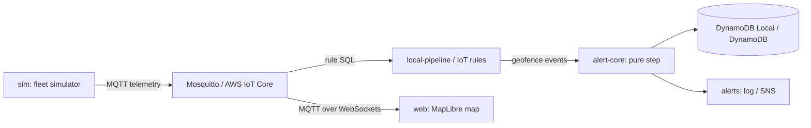

# iot-telemetry developer guide

## 1. What it is

A simulated vehicle fleet publishes telemetry over MQTT. One set of IoT Rule SQL routes it locally (Mosquitto) and in AWS (IoT Core, CDK). A small pure alert core turns noisy, duplicated geofence events into one alert per real crossing. A MapLibre map shows the fleet live.

Measured headline (`bench/results/latest.json`, compose run): 200 vehicles at 1 Hz, 12000 sent and 12000 received, p99 7.2 ms publish-to-subscriber. Over 1000 fuzzed geofence timelines the core fired 5896 alerts, exactly the 5896 crossings of an independent reference model (0 duplicates, 0 missed). Naive alerting fired 7829 ENTER alerts against the core's 3184 ENTERED.

## 2. Quickstart (5 minutes)

Needs Node 24, pnpm 9.12.0 and Docker.

```powershell
pnpm install --frozen-lockfile
docker compose up -d --build
# open http://localhost:5373
docker compose logs pipeline    # shows "ALERT ENTERED ..." lines
docker compose down
```

Ports used: 5370 (MQTT), 5371 (MQTT-WS), 5372 (DynamoDB Local), 5373 (web).

## 3. Architecture



Locally the pipeline stands in for IoT rules, Amazon Location and the alert Lambda. In AWS the CDK stack declares them. There is no deploy proof: no LocalStack token, so AWS work is checked by unit tests and `cdk synth` with cdk-nag.

## 4. Project layout

| Path | What |
|---|---|
| `packages/schema` | Telemetry schema, fixtures, topics, rule SQL and its interpreter |
| `packages/alert-core` | Pure alert state machine, reference model, publishable package |
| `packages/sim` | Seeded fleet simulator, scenarios, MQTT sink, record/replay |
| `packages/alert-lambda` | Location event mapping, optimistic-concurrency handler, repos, sweep |
| `packages/local-pipeline` | Local router and pipeline, golden scenarios |
| `packages/web` | Vite, React, MapLibre live map, Playwright e2e |
| `infra` | CDK stack, topic rule construct, device policy, cdk-nag gate |
| `bench` | Latency and alert-correctness benchmark |
| `docs/adr` | Decision records |

## 5. Run, test, benchmark

```powershell
pnpm lint; pnpm typecheck; pnpm test; pnpm build
pnpm synth
pnpm --filter @iot-telemetry/alert-core run pack:check
docker compose up -d --wait mosquitto dynamodb
$env:IOT_IT_MQTT_URL='mqtt://localhost:5370'; $env:IOT_IT_MQTT_WS_URL='ws://localhost:5371'; $env:IOT_IT_DYNAMO_URL='http://localhost:5372'; pnpm test:int
docker compose down
docker compose --profile e2e run --rm e2e       # needs the stack up
docker compose --profile bench run --rm bench   # writes bench/results/latest.json
```

## 6. Key decisions and what they gave up

- [ADR 0002](adr/0002-local-stand-ins-without-localstack.md) DynamoDB Local and Mosquitto instead of LocalStack: no deploy proof.
- [ADR 0003](adr/0003-history-firehose-s3-not-timestream.md) Firehose to S3 plus a DynamoDB latest table instead of Timestream (in maintenance mode): no time-bucket queries.
- [ADR 0004](adr/0004-optimistic-concurrency-transaction.md) Optimistic-concurrency transactions: notifications are at-most-once; an outbox is v0.2.
- [ADR 0007](adr/0007-toolchain-and-versions.md) TypeScript 6.0.3 pinned by the lint plugin peer range: no TS 7 speed.

See `docs/adr/` for all eight.

## 7. Known limits and what's left

- Nothing is deployed to AWS. Integration tests run against Mosquitto and DynamoDB Local only.
- SNS notifications are at-most-once after the commit (ADR 0004).
- The cloud `Latest` table is last-write-wins, so replayed old messages move a vehicle backwards.
- The dwell sweep runs once a minute in the cloud, so confirmation can lag by up to 60 s.
- No reorder buffer: the core is safe under reordering but not complete.
- v0.2: real deploy, certificates, read API, Cognito, geofence editor, Device Shadow, outbox, reorder buffer.
